# 1. Introduction

# 2. Hello World
## Software required

## Creating react app

## Code

## For running app - navigate inside folder and run command

## Edit app.js
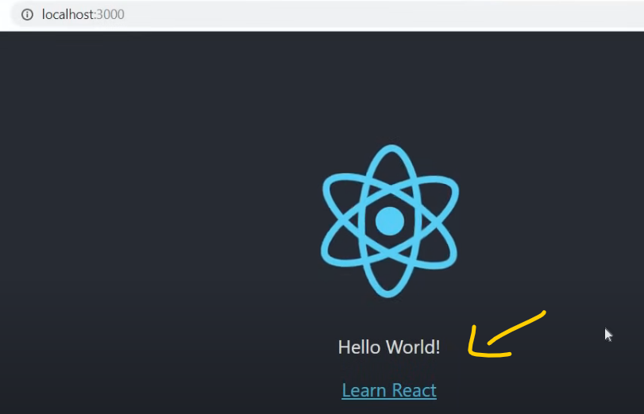
## Ways to create react app

- npm mein pkg globally install karo
- then create karo project
# 3. Folder Structure
## package.json 
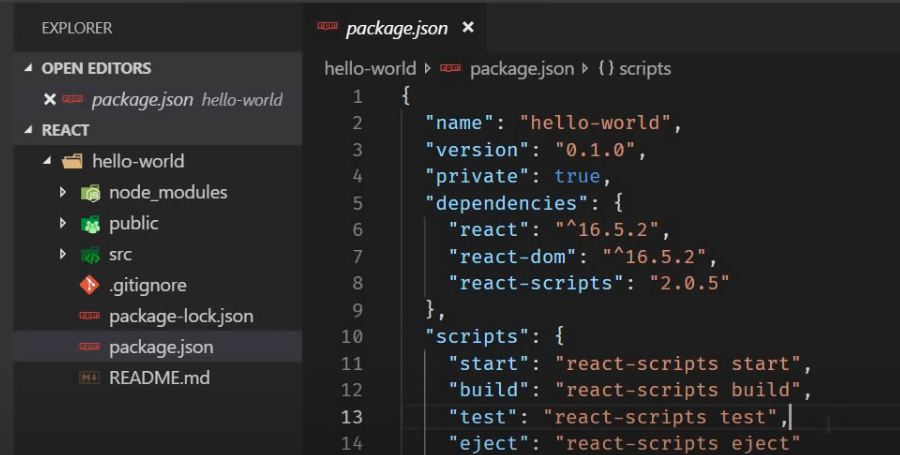
-Contain dependency and script require for project
## package-lock.json 

- ensure consitent installation of your dependency.
## We have gitIgnore and readme file
## node-module

- yaha sari dependency hoti hai
- jab create-react-app command chalate tab ye folder create hota.
## public

- yaha hum react ko controll denge.
## src folder
### Starting point is index.js
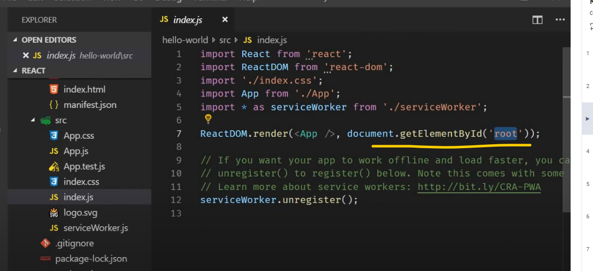
### App component

- jo browser mein dekh rahe wo yaha se aa rha
- app.css for css styling
- app.test for unit test
- index.css apply style in body tag
## Flow
- jab bhi npm start command chalate tab index.html serve hoti browser mein
- iske baad control index.js mein jata
    - yaha react component dom render karta dom node ko
- yaha se app.js mein jata.. yaha se html dikhta
# 4. Components
- Component is a part of UI
- Components are reusable
- components also contain other component
## Eg

- Yaha total 5 component hai
- jo main component hai usse root component bolenge.
## How component translate code in our app.
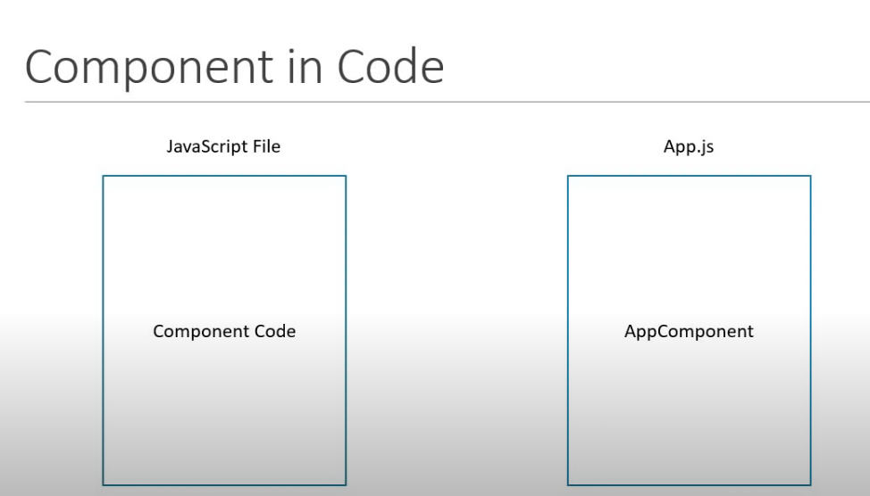
- component ko hum js file mein rakhte generally.
## Components types

## Apne code ko khangalo

## Imp

# 5. Functional Component

- ye ek js function
- ye input leta hai optionally object of property(prop)
- Aur  output  deta hai jsx i.e UI
## Create functional component
#### Target hai greeting karna

### Via Arrow function

## Intresting thing 
## 1) Default export
### Yaha hum default export kar rahe hai Greet.js mein

### Isse hum isse kisi bhi name se import kar sakte

## 2) Named Export

### Exact same name se import karna honga wo bhi curly braces mein

### Agar galat name se import  kiya

# 6. Class Component
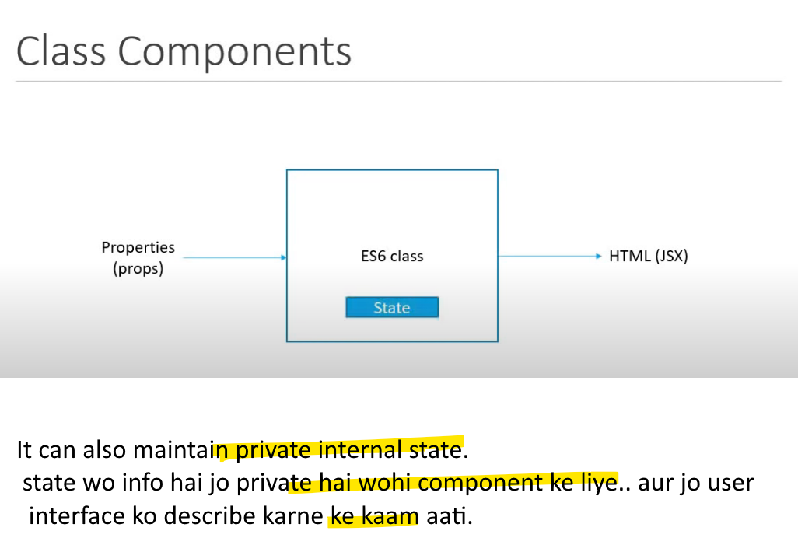
## Create class component for Greeting

## Comparison

# 7. Hooks Update

# 8. JSX

## Create component using Jsx 

## Create component without using JSX

### Varaition-1

### Variation-2

### Variation-3

### Imp

### Class bhi dalte, id ke jaise

### Imp 2
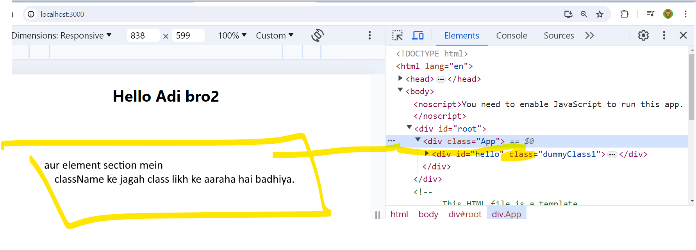
### Imp3

- jsx mein aise likhenge.
- jsx ke liye aapko React lib import karna hota hai
- jsx se code likhne padne mein aasan hota
- kaha tak React.createElement() likhte baithonge, aaj 2 component hai kal payli ke 50 honge.
### Imp4

# 9. Props
## Components are reusable(app Greet component ko mulitple time use kar sakte)

### Ab yadi hume 3 alag alag logo ko greet karna hai - so for this props comes in picture
- props is property object(optional)
- it allow component to dynamic
### Hum aap component se name bhejehge Greet component ko.. and that will be render in browser

### Var -1 

### var-2 hum react lib ko expression evaluate karne bolenge

## Passing other prop
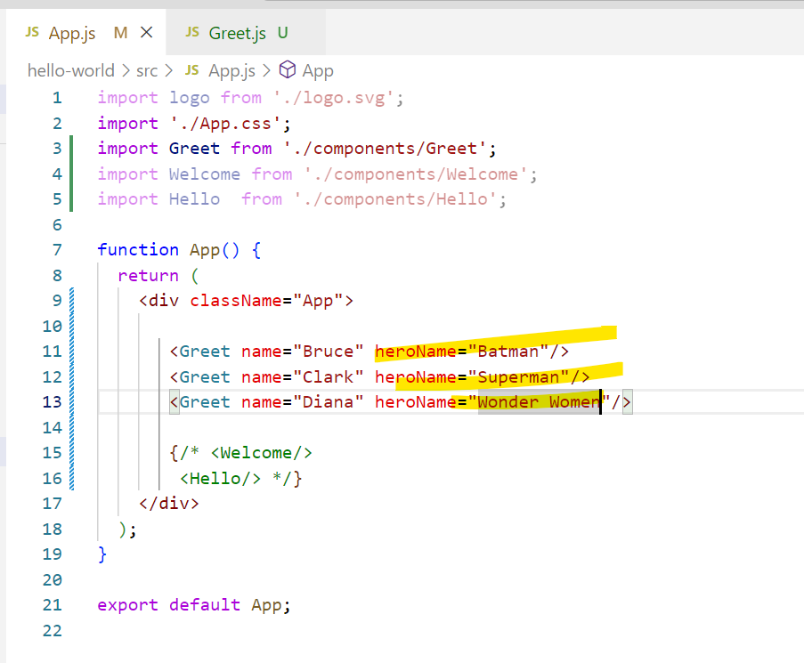
## Unknown content aap Opening closing tag ke bich likhe..

### Ab isse retrieve kaise kare.

### Why? kyuki jsx mein sirf ek hi element return hota, so wrap all element into 1

### Next one
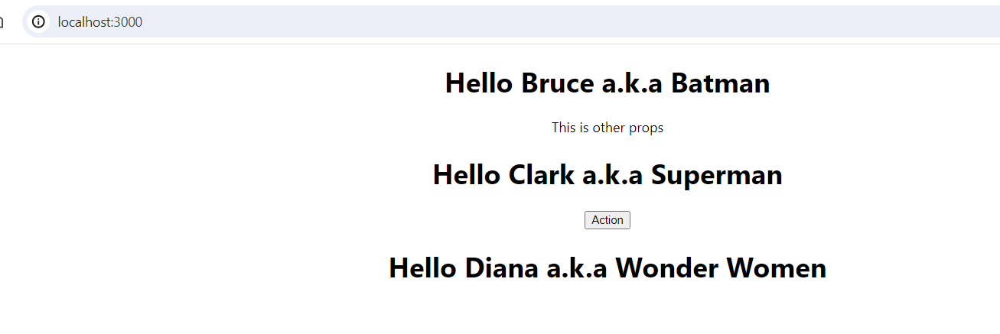
## Props with class Component

## Imp
- props are immutable
- i.e value cannot be change
- react component have to act like pure function with respect to props parameter.(isiliye aap change nhi kar sakte.)

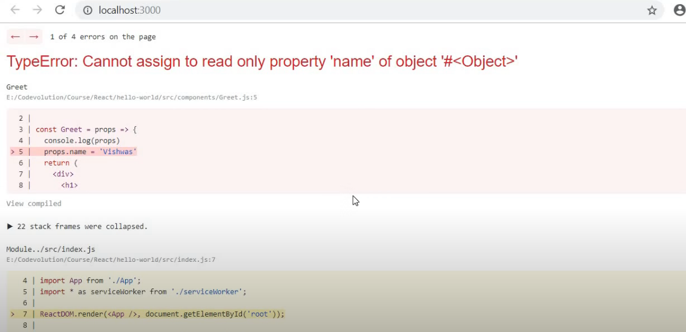
# 10. State
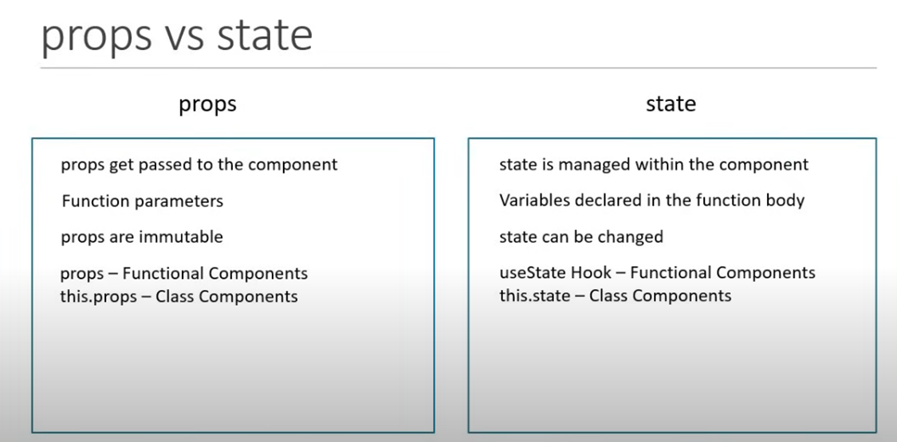
- Jaise hum props ko render karte dynamically waise hi same hum state ko bhi render kar sakte
## Create class Component

## Variation-1 use state to render message

- Now we have abliity to change value
## Varaition-2 create a button

## Variation-2
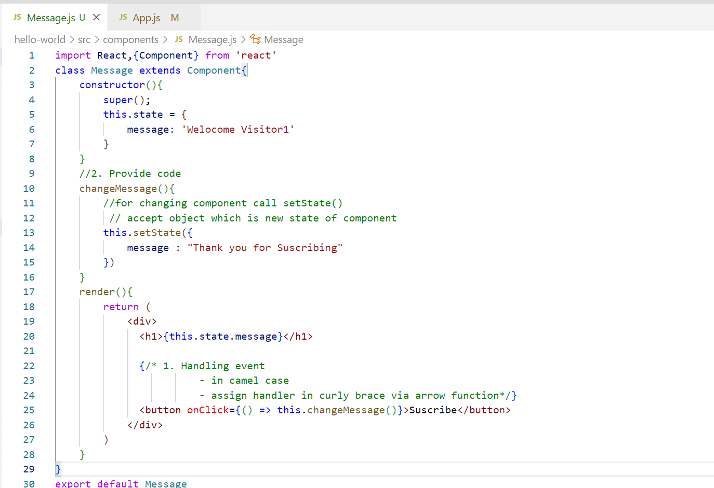
- state is nothing but object which is privately maintain inside the component.
- It can influence what is render on browser.
- State can be change within component
# 11. setState
## Do's and Don't in state and setState
### Counter component we have count value and button to increment count value.
## Note:***Shortcut : - Type rce*** class component

###  count state  to track counter value
## Note: ***shortcut*** rconst for parmeterize constructor

### Variation-1 write click event code

## Yaha hum state directly modify kar rahe hai.
## Note : ***Never modify state directly***.
- aap ***this.state*** sirf constructor mein initialize kar sakte ho
- uske alawa aap use karonge tab ***browser render nhi karbe***.
- aur kahi bhi aapko change karna hai state ko so use ***setState()*** method.
## Varaition-2

## ***Do's Never modify state directly***
### Observation

## Variation-3
- Isko hatene ke liye use callBack() function
- it's 2nd parameter to setState() method
- callback function is again arrow function
### Code

## Do's ***Whenever you need to execute the code after state has been change, so don't place the code right after setState() method***
- Instead place within call function which is pass as 2nd arg to setState() method
## Complicate Scenario
### incremnet hona chaiye 0 to 5 jab bhi clk kare increment button

## Imp:
- abhi aap previous state ke hisab se update nhi kar rahe..
- agar previous state ke hisab se update karna hai tab
- So pass function as argument to setState() instead of an object

- prvious State ke hisab se aapko calculate karna hai state tab pass function to setState() as argument instead of object
- yadi props bhi aaa raha hai aur usse add karna hai
### Code snippet

# 12. Destructuring Props and State

## Destructuring props in functional Component
### in function parameter

### Destructuring in function body

## Destructur props in Class Component

### in render() you destructure it

### Similary for state property

# 13. Event Handling
- When user Interacts with your application events are fired.
- mouse clk, mover hover, key press so on.
- your app able to handle such events and execute necessary code.
## Handle events in Functional Component
## ***Shortcut: type rfce***

- When user click on this button 
- clk event is fired 
### Target: to capture that clk event and execute the basic code

## Common Mistakes

### Problem with function call

- button click kiye tab bhi, button clk console mein nhi aaya.
- Event handler ye function hai {function} and not the function call {function()}
## Event Handling in Class component
## ***Shortcut rce- class component***
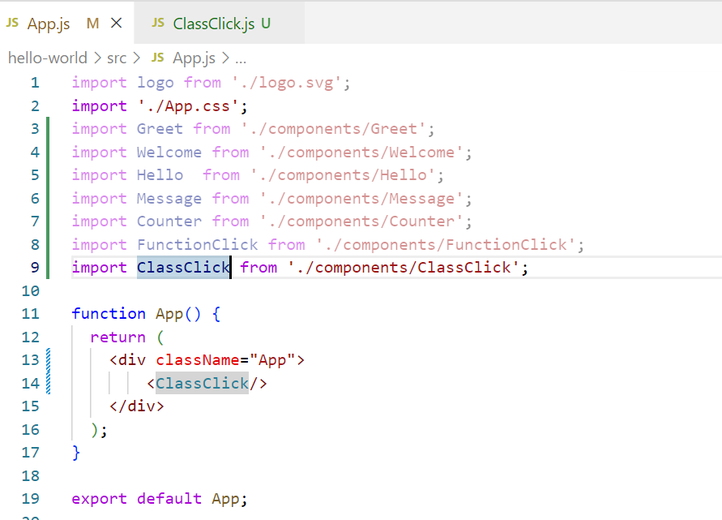
### Adding event handler in class compnent

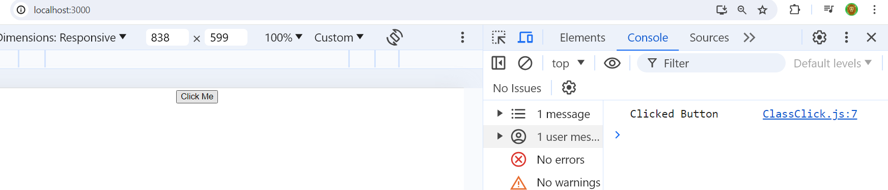
# 14. Binding Event Handler
### How to bind event handler in react component
#### knowledge of this keyword in javascript required
### Target: Clk on button and change the state
### rce - class component

### Create a state and bind it to UI
### rconst - for constructor(where state is initialilzed)

### Change this message to GoodBye! when user click on button

### let's console this keyword

- so this keyword in eventHandler is undefined..
- Typical behaviour of js
- so that's why event binding is necessary in event handler
### 1) Bind the handler in render() method

- badhiya hai small app ke liye
- but bade app ke liye nhi 
### 2) Use arrow function in render() method

- having performance issue in some scenario
### 3) Binding the event handler in constructor

- this is better since binding happens once in constructor
### 4) Arrow function as a class property
#### Basically change a way you define method in calss

- 1st and 2nd approach sahi nhi
- 3rd approach better
- 4rth is expreimental feature.
# 15. Methods as props

